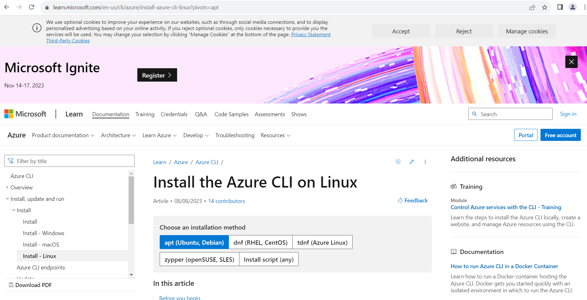
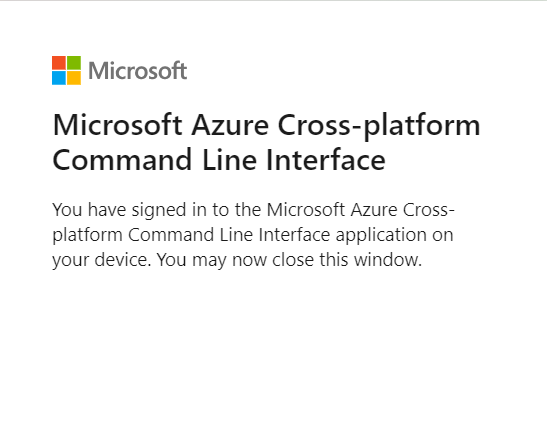

# Steps to set up Azure CLI

- download Azure CLI using the download link: https://learn.microsoft.com/en-us/cli/azure/install-azure-cli

Then install using 

curl -sL https://aka.ms/InstallAzureCLIDeb | sudo bash
- all commands on azure cli start with az

- login with az login

- validate on the web browser 