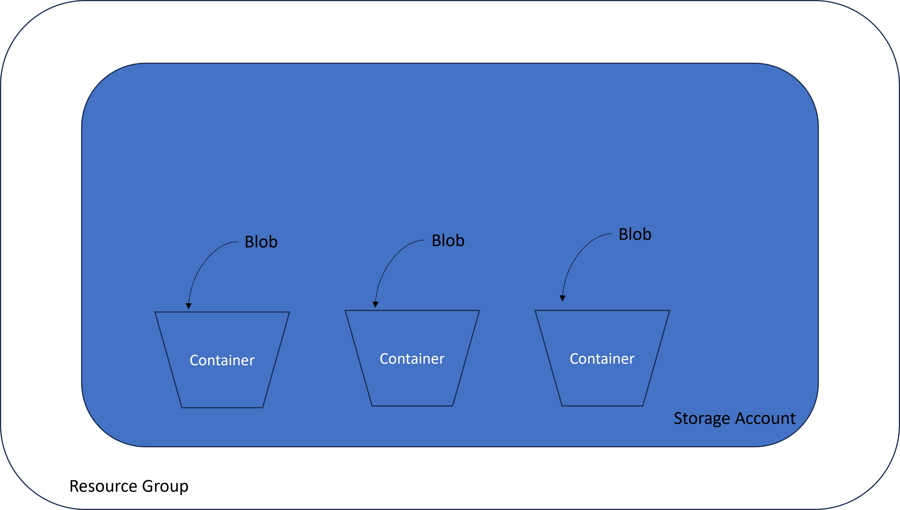

# Blob storage

## What is Blob Storage

Blob stands for Binary Large Object Storage is a type of storage used as way to store unsturctured data.

Blobs are located within a storage account within a resource group

The cheapest form of blob storage is archival

Blobs are stored in containers (think of throwing clothes (blobs) on the bed (container)).

If you are accessing blobs a lot then the access tier will be hot. (frequent= hot)

Subsequent tiers are cold and then archival being the lowest. (medium= cold, rarely = archival)

If you want to make access archival you need to do it manually and say its archival lets say if youre not acessing it for months/years

You can change the access level also via command

The right access tier is critical as othersise it will cost more. e.g. a regularly accessed website should be in the hot tier if not it would cost more to grab the data from another access tier.

## Soon we will be using Azure CLI with blob storage

We will be doing the following steps soon:

- Creating a storage account 
- Creating a container
- Finding and downloading the blob "cat.jpg"

# Types of redundancy : 

- LRS (locally redundant storage 3 copies, 1 availavility zone): stores multiple copies in one AZ
- ZRS (sone redundant storage): stores a copy in each azailability zone
- There are also different tiers as mentioned above
