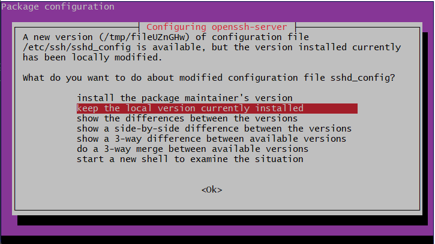

Follow the steps in SettingUpAzureVM.md to set up both the app and VM adding appropriate user data located in this md to configure the resource.

First we can take a look at the structure of a Virtual machine: 


## Blocker

## Initially there was an issue running the user data scripts as the openssh-server was not in sync. I over came this blocker by modifying the upgrade command to ensure that the interactive screen was no longer interactive and that an option was selected automatically. After research the command I found was 

```bash 
export DEBIAN_FRONTEND=noninteractive
sudo DEBIAN_FRONTEND=noninteractive dpkg --configure -a
sudo apt update -y
sudo DEBIAN_FRONTEND=noninteractive apt upgrade -yq -o Dpkg::Options::="--force-confnew"

```

## But after colloaboration with colleagues I discovered we can condense this command into 

```bash
sudo apt update && sudo DEBIAN_FRONTEND=noninteractive apt upgrade -y
```

# For the db VM

## When setting up the db we need to ensure its in a private subnet and that mongodb has been alled in the security group rules.

## We would also want our db to only have a private ip

## As mentioned we can follow the steps to set up the db VM ensuring to set up the user data with the following script:

```bash
#!/bin/bash

# update and upgrade
sudo apt update && sudo DEBIAN_FRONTEND=noninteractive apt upgrade -y

# get mongodb
wget -qO - https://www.mongodb.org/static/pgp/server-3.2.asc | sudo apt-key add -

echo "deb http://repo.mongodb.org/apt/ubuntu xenial/mongodb-org/3.2 multiverse" | sudo tee /etc/apt/sources.list.d/mongodb-org-3.2.list

#restart/start nginx
sudo apt update

#enable nginx
sudo apt-get install -y mongodb-org=3.2.20 mongodb-org-server=3.2.20 mongodb-org-shell=3.2.20 mongodb-org-mongos=3.2.20 mongodb-org-tools=3.2.20

# install sed
sudo apt install sed

# replace the bindIP in mongo
sudo sed -i 's/bindIp: 127.0.0.1/bindIp: 0.0.0.0/' /etc/mongod.conf

# note to know if it was successfully modified
echo "Modified MongoDB configuration to allow all connections."

# Enable MongoDB to run
sudo systemctl start mongod
sudo systemctl enable mongod
sudo systemctl status mongod
```


# For the app VM

## As mentioned we can follow the steps to set up the App VM ensuring to set up the user data with the following script:

```bash

#!/bin/bash

# update & upgrade
sudo apt update && sudo DEBIAN_FRONTEND=noninteractive apt upgrade -y

# install nginx
sudo apt install nginx -y

# setup nginx reverse proxy
sudo apt install sed
# $ and / characters must be escaped by putting a backslash before them
sudo sed -i "s/try_files \$uri \$uri\/ =404;/proxy_pass http:\/\/localhost:3000\/;/" /etc/nginx/sites-available/default

# restart nginx 
sudo systemctl restart nginx

# install nodejs 12.x
curl -sL https://deb.nodesource.com/setup_12.x | sudo -E bash -
sudo apt-get install nodejs -y
export DB_HOST=mongodb://20.39.220.189/posts

# install pm2 (only necessary later)
sudo npm install pm2 -g

# clone repo with app folder into folder called 'repo' - only needed if don't have the app folder already
git clone https://github.com/LSF970/sparta_test_app.git repo

# install the app (must be after db vm is finished provisioning)
cd repo/app

npm install
node seeds/seed.js

pm2 kill
# start the app (could also use 'npm start')
pm2 start app.js

```
