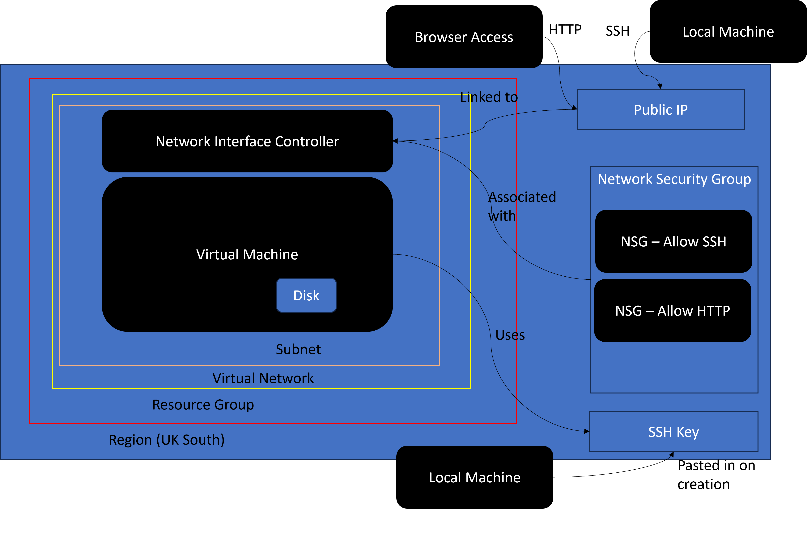
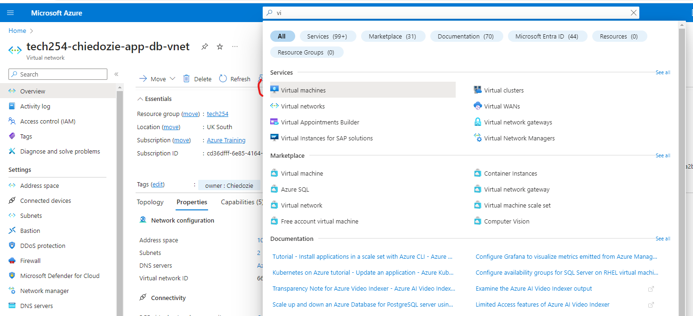
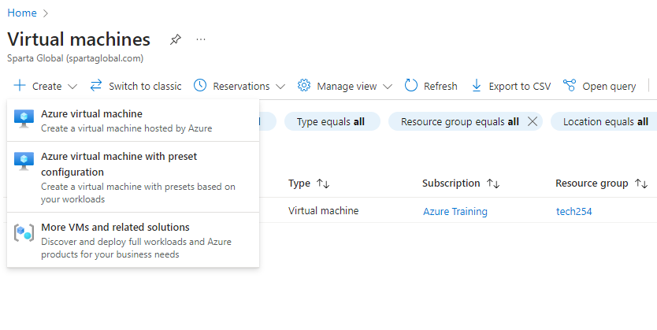
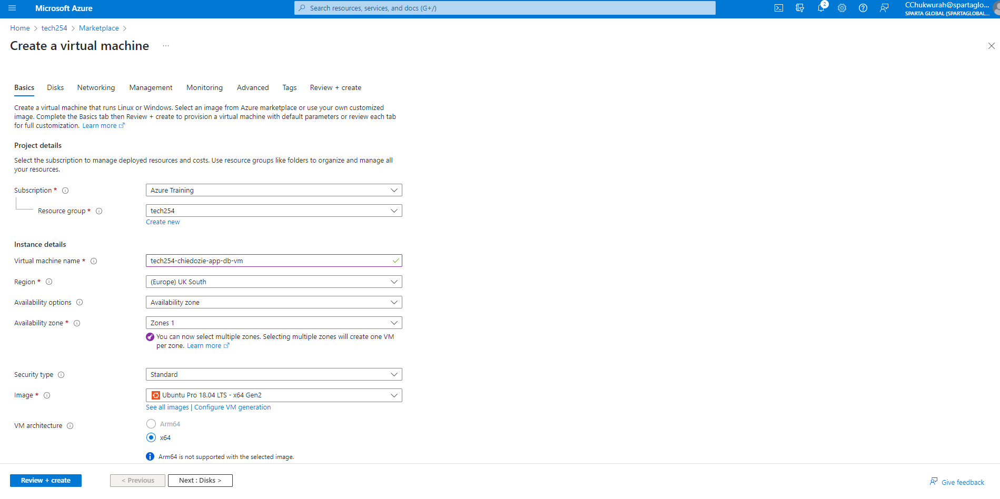
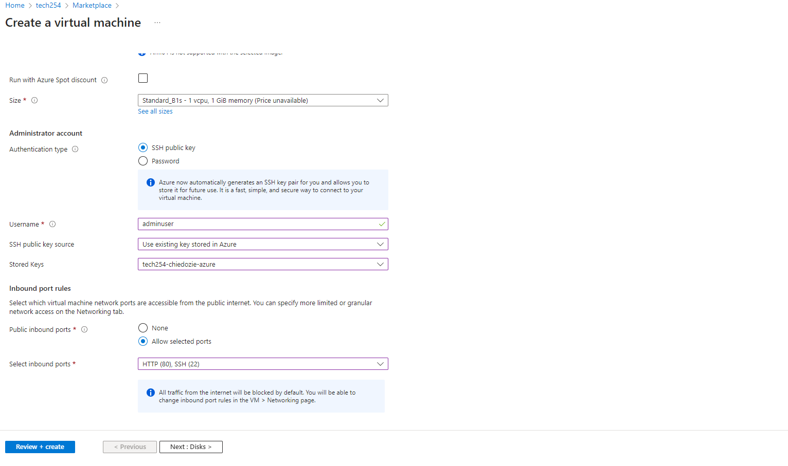
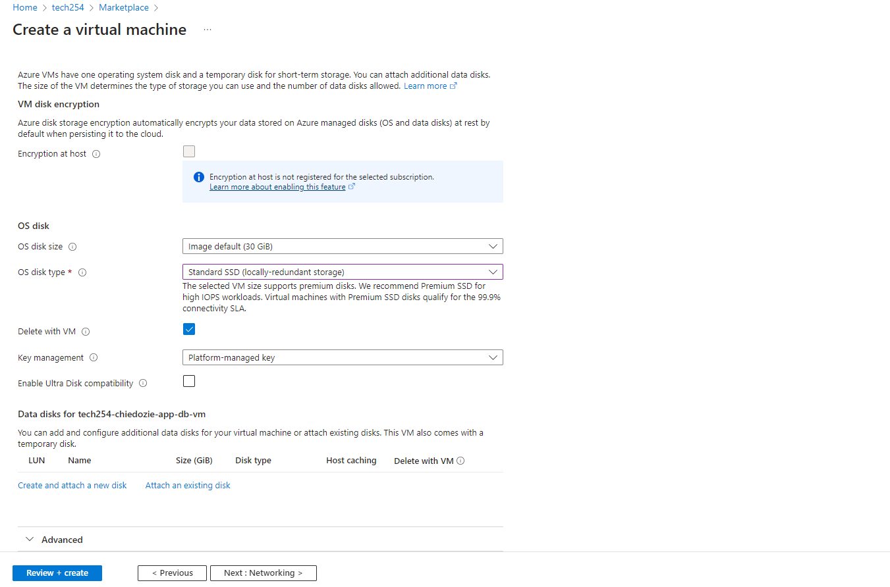
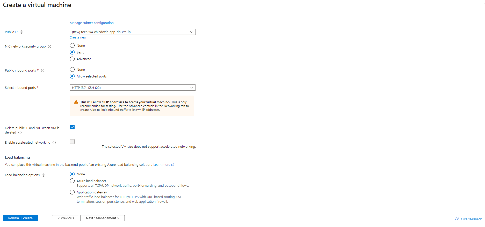
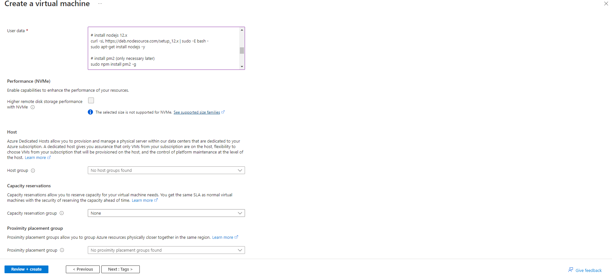

# Setting up an Azure Virtual Machine

## First we can take a look at the structure of a virtual machine on Azure:

## In order to set up a VM we could follow these steps:

## Step 1 - Select Create a Virtual Machine in the search bar or from the resource group as it is a resource

SettingUpAzureVM.md  

## Step 2 - Select the details of the VM including resource group and availability zones. Here we can also select the secturity type for the chosen image, in this case Ubuntu Pro 18.04 LTS

## Step 3 - Select the standard disk size

## Step 4: Select the Public IP and Basic Network security Groups

## Step 5: Input user data from provision file to install App

