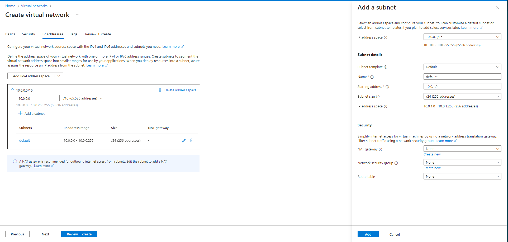

# Azure Virtual Network

## This is similar to AWS VPN and is Azures virtual private network

## Navigate to Azure VN via the search bar

## Create a Virtual Network with the required resource group, security configurations and Virtual Network Name its also important to tag 'owner' so as to know any billing or other dependencies

# Availability Zones - not limited to 3 in aws, however in Azure there is a maximum of 3
